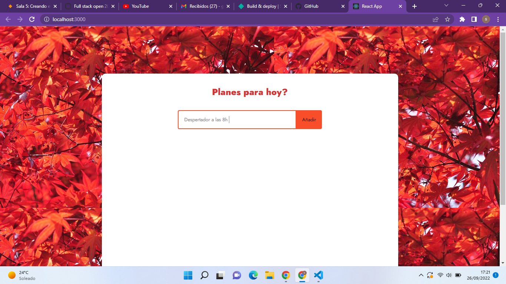
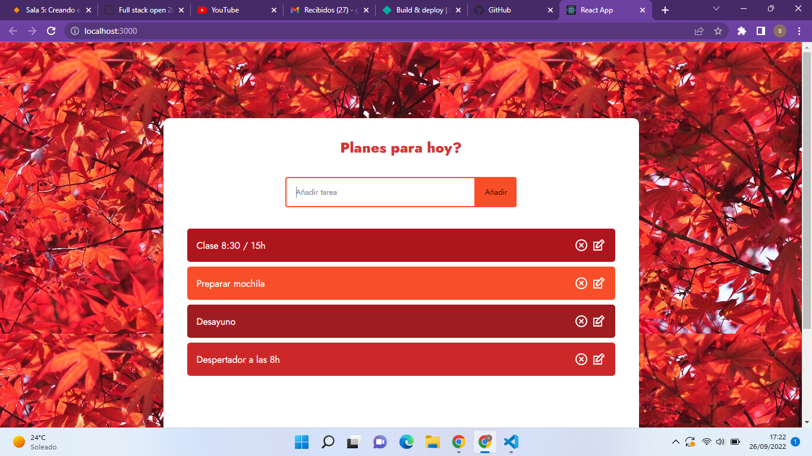
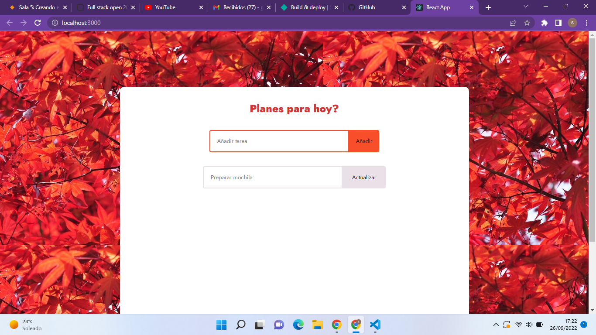
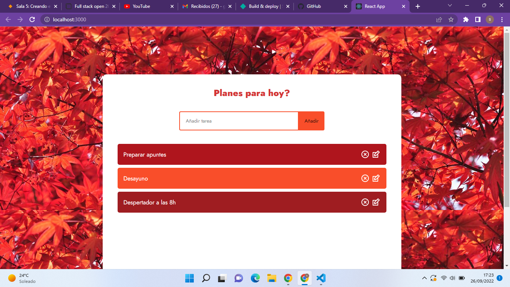

# TASKSLIST

## Tabla de Contenidos

1. [Información General](#información-general)
2. [Capturas de Pantalla](#capturas-de-pantalla)
3. [Tecnologías](#tecnologías)
4. [Instalación](#instalación)
5. [Soporte](#soporte)
6. [Hoja de ruta](#hoja-de-ruta)
7. [Autora](#autora)

***
## Información General

Proyecto basado en un ejercicio en React para el curso de Full-Stack Developer de Factoria F5, que consiste en la creación de una web donde apuntar una lista de tareas, editarlas y eliminarlas.

*Proyecto en proceso de desarrollo.*   

***

## Capturas de pantalla








## Tecnologías

Lista de tecnologías usadas en el desarrollo del proyecto:

* HTML: Version HTML 5 
* CSS: Version CSS3
* [Node.js] (https://nodejs.org/es/)
* [React] 

***
## Instalación

Como instalar el repositorio:

1. Ingresar en Visual Studio Code
2.  Clonar el proyecto con el comando: 
 ``` 
git clone https://github.com/gilsusana/taskslist

```
En Visual Studio Code:
1. Instalar [React.js](https://es.reactjs.org/)
2. Instalar [React-router-dom](https://reactrouter.com/)
3. Instalar [React-icons] npm install react-icons

***


## Soporte

Si tiene cualquier problema póngase en contacto con: 

>susanagildeveloper@gmail.com
***

## Hoja de ruta

En la primera entrega podemos agregar, editar y eliminar las tareas. En la próxima versión se pretenderá una persistencia de datos.

## Autora

**Susana Gil** 


